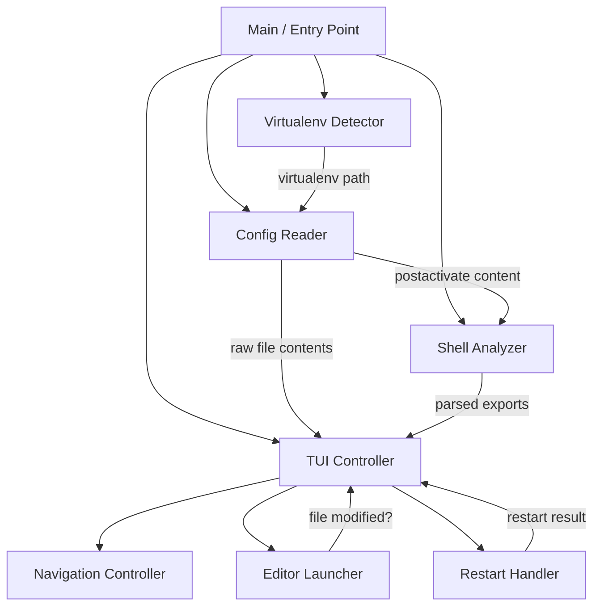

# Design Document: virtualenv-config-viewer

## Overview

This design describes an interactive terminal UI application implemented in three languages (Python, Rust, Go) that detects the active Python virtualenv, reads its configuration files, analyzes shell exports, and presents them in a navigable paged view with inline editing support.

The multi-language approach serves as a learning exercise to compare how compiled languages (Rust, Go) differ from Python in handling the same problem domain: file I/O, string parsing, terminal manipulation, and process management.

### Key Design Decisions

1. **Shared architecture, idiomatic implementations** — All three implementations follow the same component architecture and user-facing behavior, but each uses language-idiomatic patterns and libraries.
2. **Minimal dependencies for Python** — Python uses the standard library `curses` module (available on Linux/macOS) to keep the implementation lightweight and maximize learning from lower-level terminal APIs.
3. **Ratatui + Crossterm for Rust** — The dominant TUI ecosystem in Rust, providing immediate-mode rendering with a Crossterm backend for cross-platform terminal control.
4. **Bubble Tea for Go** — Follows the Elm Architecture (Model-View-Update) pattern, which is the modern standard for Go TUI applications.
5. **Regex-based shell parsing** — The Shell Analyzer uses regex pattern matching rather than spawning a subshell, keeping the tool deterministic and fast.

### Language Complexity Assessment

Based on the requirements, here's where each language will shine or struggle:

| Concern | Python | Rust | Go |
|---------|--------|------|-----|
| Shell parsing (regex) | Easy — `re` stdlib | Medium — `regex` crate | Easy — `regexp` stdlib |
| Terminal UI | Medium — `curses` is low-level | Medium — Ratatui is well-documented | Easy — Bubble Tea is high-level |
| File I/O / error handling | Easy — exceptions | Medium — Result types everywhere | Easy — explicit error returns |
| Process management (editor) | Easy — `subprocess` | Medium — `std::process::Command` | Easy — `os/exec` |
| Build system | Easy — pyproject.toml | Easy — Cargo | Easy — go.mod |

> **Note to user**: None of these three implementations represents a "heavy lift" that would justify dropping a language. The complexity is well-balanced. If you find yourself time-constrained, Go is the most likely candidate to defer — it overlaps conceptually with Rust (compiled, statically typed) while Rust teaches you more about memory ownership and lifetimes.

## Architecture

All three implementations share the same layered architecture:



### Data Flow

1. **Startup**: Entry point reads CLI flags/env/config for options (e.g., restart-on-edit)
2. **Detection**: Virtualenv Detector resolves the active virtualenv path using the priority chain
3. **Reading**: Config Reader loads `pyvenv.cfg` and `postactivate` file contents
4. **Analysis**: Shell Analyzer parses the postactivate script for exports, aliases, functions
5. **Rendering**: TUI Controller builds paged content and enters the event loop
6. **Interaction**: Navigation Controller handles key events; Editor Launcher handles `e`; `q` exits

### Configuration Precedence

```
CLI flag > Environment variable > Config file > Default (disabled)
```

The restart-on-edit option follows this precedence. The config file is `~/.virtualenv-viewer.toml` (or language equivalent).

## Components and Interfaces

### Component 1: Virtualenv Detector

**Responsibility**: Locate the active virtualenv directory.

**Interface** (pseudo-API, adapted per language):

```
detect_virtualenv() -> Result<Path, DetectionError>
```

**Detection Priority**:
1. `$VIRTUAL_ENV` environment variable (validate with `pyvenv.cfg` check)
2. `$PWD/.env` directory
3. `$PWD/.venv` directory
4. `$PWD/venv` directory
5. `$PWD/env` directory

**Validation**: A directory is valid if it contains a `pyvenv.cfg` file at its root.

**Error Cases**:
- `VIRTUAL_ENV` set but invalid → specific error message + exit code 1
- No virtualenv found → error listing all attempted paths + exit code 1

#### Language-Specific Notes

| Language | Implementation Detail |
|----------|---------------------|
| Python | `os.environ.get()`, `pathlib.Path`, `sys.exit()` |
| Rust | `std::env::var()`, `std::path::PathBuf`, `std::process::exit()` |
| Go | `os.Getenv()`, `filepath` package, `os.Exit()` |

---

### Component 2: Config Reader

**Responsibility**: Read raw file contents of virtualenv config files.

**Interface**:

```
read_configs(venv_path: Path) -> ConfigFiles

struct ConfigFiles {
    pyvenv_cfg: Option<String>,      // raw text or None if unreadable
    postactivate: Option<String>,    // raw text or None if unreadable
    postactivate_path: Path,         // expected path (for editor)
}
```

**File Locations**:
- `pyvenv.cfg`: `{venv_path}/pyvenv.cfg`
- `postactivate`: `{venv_path}/bin/postactivate`

**Behavior**:
- Missing files → `None`, no error displayed
- Permission/IO errors → `None`, no error displayed
- If both are `None` → display "no configuration files found" message

---

### Component 3: Shell Analyzer

**Responsibility**: Parse `postactivate` content and extract shell exports.

**Interface**:

```
analyze_shell(content: String) -> ShellExports

struct ShellExports {
    variables: Vec<ShellVariable>,   // name + literal value
    aliases: Vec<ShellAlias>,        // name + definition
    functions: Vec<ShellFunction>,   // name + body
}

struct ShellVariable { name: String, value: String }
struct ShellAlias { name: String, definition: String }
struct ShellFunction { name: String, body: String }
```

**Parsing Rules**:
- Variables: Match `export NAME=VALUE` and `export NAME="VALUE"` patterns
- Aliases: Match `alias NAME=VALUE` and `alias NAME="VALUE"` patterns
- Functions: Match `function_name() { ... }` and `function function_name { ... }` patterns
- Last-write-wins: If a name appears multiple times, keep only the final definition
- No variable expansion: `$HOME/bin` stays as literal text

**Regex Patterns** (shared across languages):

```regex
# Export statements
^export\s+([A-Za-z_][A-Za-z0-9_]*)=(.*)$

# Alias statements  
^alias\s+([A-Za-z_][A-Za-z0-9_-]*)=(.*)$

# Function definitions (bash/zsh compatible)
^(?:function\s+)?([A-Za-z_][A-Za-z0-9_]*)\s*\(\)\s*\{
  (capture body until matching closing brace)
\}$
```

---

### Component 4: TUI Controller

**Responsibility**: Render paged content and manage the event loop.

**Interface**:

```
run_tui(config_files: ConfigFiles, exports: ShellExports, options: AppOptions) -> Result<(), Error>
```

**Layout**:
```
┌─────────────────────────────────────────────┐
│ [Content area: terminal_rows - 2 lines]     │
│                                             │
│ ...paged content...                         │
│                                             │
├─────────────────────────────────────────────┤
│ Status: virtualenv-name | Page 2/5          │
│ Keys: ↑/↓ navigate | e edit | q quit       │
└─────────────────────────────────────────────┘
```

**Content Sections** (displayed in order):
1. `pyvenv.cfg` contents (with header)
2. `postactivate` raw contents (with header)
3. Parsed exports summary (variables, aliases, functions)

#### Language-Specific TUI Libraries

| Language | Library | Architecture Pattern |
|----------|---------|---------------------|
| Python | `curses` (stdlib) | Imperative event loop with `getch()` |
| Rust | `ratatui` + `crossterm` | Immediate-mode rendering in a loop |
| Go | `bubbletea` + `lipgloss` | Elm Architecture (Model-View-Update) |

---

### Component 5: Navigation Controller

**Responsibility**: Handle keyboard input for paging.

**Key Bindings**:
- `↓` (Down Arrow): Next page
- `↑` (Up Arrow): Previous page
- `e`: Open editor
- `q`: Quit

**Paging Logic**:
```
page_size = terminal_rows - 2
total_pages = ceil(total_content_lines / page_size)
current_page = clamp(current_page, 1, total_pages)
```

**Resize Handling**: On `SIGWINCH` (or equivalent), recalculate `page_size` and re-render.

---

### Component 6: Editor Launcher

**Responsibility**: Open the postactivate file in the user's editor.

**Process**:
1. Check `$EDITOR` is set and non-empty → error if not
2. Check postactivate file exists → error if not
3. Record file modification timestamp
4. Suspend TUI (leave alternate screen)
5. Spawn editor process: `$EDITOR {postactivate_path}`
6. Wait for editor to exit
7. Check if spawn failed → error if editor command not found
8. Resume TUI (re-enter alternate screen)
9. Compare modification timestamp → refresh content if changed
10. If restart-on-edit enabled and file changed → trigger restart

---

### Component 7: Restart Handler

**Responsibility**: Deactivate and reactivate the virtualenv.

**Mechanism**: Execute `deactivate && source {venv_path}/bin/activate` in a subshell.

**Constraints**: This only applies meaningfully to the parent shell if the viewer is `source`d or uses `exec`. In practice, the restart emits the deactivate/activate commands and displays a confirmation. The viewer itself cannot modify the parent shell's environment directly.

**Design Decision**: The restart handler will execute the deactivate/activate sequence and report success/failure. The user's shell session will reflect changes on next command (since the viewer runs in a child process). This is a known limitation documented in the UI.

---

### Component 8: App Options / Configuration

**Responsibility**: Parse and merge configuration from multiple sources.

**Sources** (highest to lowest precedence):
1. CLI flags: `--restart-on-edit` / `--no-restart-on-edit`
2. Environment variable: `VENV_VIEWER_RESTART_ON_EDIT=1|0|true|false`
3. Config file: `~/.virtualenv-viewer.toml` with `restart_on_edit = true|false`

**Interface**:
```
struct AppOptions {
    restart_on_edit: bool,  // default: false
}
```

#### CLI Parsing Libraries

| Language | Library |
|----------|---------|
| Python | `argparse` (stdlib) |
| Rust | `clap` |
| Go | `cobra` or stdlib `flag` |

## Data Models

### Core Data Structures

```
// Virtualenv detection result
VenvPath {
    path: AbsolutePath
    name: String          // basename for display
}

// Configuration file contents
ConfigFiles {
    pyvenv_cfg: Option<String>
    postactivate: Option<String>
    postactivate_path: AbsolutePath
    postactivate_mtime: Option<Timestamp>
}

// Parsed shell exports
ShellExports {
    variables: Vec<ShellVariable>
    aliases: Vec<ShellAlias>
    functions: Vec<ShellFunction>
}

ShellVariable {
    name: String
    value: String       // literal, unresolved text
}

ShellAlias {
    name: String
    definition: String  // everything after the =
}

ShellFunction {
    name: String
    body: String        // full function body between braces
}

// Application state
AppState {
    venv: VenvPath
    configs: ConfigFiles
    exports: ShellExports
    options: AppOptions
    current_page: usize
    total_pages: usize
    page_size: usize
    content_lines: Vec<String>   // pre-rendered content
    status_message: Option<String>
}

// Application options
AppOptions {
    restart_on_edit: bool
}
```

### Content Rendering Pipeline

Content is pre-rendered into a flat list of display lines:

```
1. Header: "═══ pyvenv.cfg ═══"
2. Lines from pyvenv.cfg (if present)
3. Blank separator line
4. Header: "═══ postactivate (raw) ═══"
5. Lines from postactivate (if present)
6. Blank separator line
7. Header: "═══ Shell Exports ═══"
8. Subheader: "── Variables ──"
9. Each variable: "  NAME = value"
10. Subheader: "── Aliases ──"
11. Each alias: "  NAME = definition"
12. Subheader: "── Functions ──"
13. Each function: "  function_name()\n    body..."
```

This flat list is then paginated based on `page_size`.


## Correctness Properties

*A property is a characteristic or behavior that should hold true across all valid executions of a system — essentially, a formal statement about what the system should do. Properties serve as the bridge between human-readable specifications and machine-verifiable correctness guarantees.*

### Property 1: Detection Priority Ordering

*For any* set of candidate directories (subset of {.env, .venv, venv, env}) that contain a valid `pyvenv.cfg` file, the Virtualenv Detector SHALL return the directory with the highest priority according to the defined order, regardless of which other valid directories exist.

**Validates: Requirements 1.3, 1.5**

### Property 2: Virtualenv Validation

*For any* directory path, `is_valid_virtualenv(path)` SHALL return `true` if and only if the file `{path}/pyvenv.cfg` exists. Directories without `pyvenv.cfg` must always return `false`; directories with `pyvenv.cfg` must always return `true`.

**Validates: Requirements 1.6**

### Property 3: Variable Export Round-Trip

*For any* set of valid shell variable names and string values (supporting both `export NAME=VALUE` and `export NAME="VALUE"` syntax, in both bash and zsh conventions), formatting them as export statements and then parsing with the Shell Analyzer SHALL produce an equivalent set of name-value pairs.

**Validates: Requirements 3.1, 3.5**

### Property 4: Alias Extraction Round-Trip

*For any* set of valid alias names and definitions (supporting both `alias NAME=VALUE` and `alias NAME='VALUE'` syntax), formatting them as alias statements and then parsing with the Shell Analyzer SHALL produce an equivalent set of name-definition pairs.

**Validates: Requirements 3.2, 3.5**

### Property 5: Function Extraction Round-Trip

*For any* set of valid function names and bodies (supporting both `name() { body }` and `function name { body }` syntax), formatting them as function definitions and then parsing with the Shell Analyzer SHALL produce an equivalent set of name-body pairs.

**Validates: Requirements 3.3, 3.5**

### Property 6: Last-Write-Wins

*For any* shell script containing multiple definitions of the same variable, alias, or function name, the Shell Analyzer SHALL return only the value from the last definition in the script, discarding all earlier definitions for that name.

**Validates: Requirements 3.4**

### Property 7: Literal Value Preservation

*For any* export statement whose value contains shell variable references (e.g., `$HOME`, `$PATH`, `${VAR}`), the Shell Analyzer SHALL return the value as literal text exactly as written, without performing any variable expansion or substitution.

**Validates: Requirements 3.6**

### Property 8: Page Navigation Bounds

*For any* valid application state with `total_pages >= 1` and `1 <= current_page <= total_pages`, applying the "next page" action SHALL result in `min(current_page + 1, total_pages)`, and applying the "previous page" action SHALL result in `max(current_page - 1, 1)`. Navigation never produces a page index outside `[1, total_pages]`.

**Validates: Requirements 4.1, 4.2, 4.3, 4.4**

### Property 9: Page Size Calculation

*For any* terminal height `h >= 3`, the page size SHALL equal `h - 2`. The total number of pages for content of `n` lines SHALL equal `ceil(n / page_size)`.

**Validates: Requirements 4.5**

### Property 10: Configuration Precedence

*For any* combination of configuration sources (CLI flag, environment variable, config file) that specify conflicting `restart_on_edit` values, the resolved value SHALL always equal the value from the highest-precedence source that is present (CLI > env > config file > default false).

**Validates: Requirements 6.5**

## Error Handling

### Error Categories and Responses

| Error | Component | User-Facing Behavior |
|-------|-----------|---------------------|
| VIRTUAL_ENV set but invalid | Detector | Print specific error message, exit code 1 |
| No virtualenv found | Detector | Print error with attempted paths, exit code 1 |
| Config file missing | Config Reader | Silent skip, return None |
| Config file permission denied | Config Reader | Silent skip, return None |
| No config files readable | Config Reader | Display informative message in viewer |
| EDITOR not set | Editor Launcher | Display error in status bar, remain in viewer |
| Editor command not found | Editor Launcher | Display error in status bar, remain in viewer |
| Postactivate missing (on edit) | Editor Launcher | Display error in status bar, remain in viewer |
| Virtualenv restart failure | Restart Handler | Display error, leave virtualenv deactivated |
| Terminal I/O error | TUI Controller | Attempt terminal restore, exit code 1 |
| Unhandled panic/exception | All | Attempt terminal restore, exit code 1 |

### Terminal Restoration Strategy

All three implementations use a cleanup handler to restore terminal state on any exit path:

- **Python**: `curses.wrapper()` handles cleanup automatically; additionally register `atexit` handler
- **Rust**: Implement `Drop` on a `Terminal` wrapper struct that calls `crossterm::terminal::disable_raw_mode()` and `LeaveAlternateScreen`
- **Go**: Use `defer` in main to call `tea.Program.Quit()` cleanup; add signal handler for `SIGTERM`/`SIGINT`

### Error Message Format

All error messages follow a consistent format:
```
Error: {brief description}
  {detail or path information}
```

Errors that prevent startup print to stderr and exit non-zero. Errors during interactive use display in the TUI status bar and don't terminate the application.

## Testing Strategy

### Dual Testing Approach

This project uses both unit tests and property-based tests:

- **Unit tests**: Cover specific examples, edge cases, integration points, and error conditions
- **Property-based tests**: Verify universal properties (Properties 1–10 above) across generated inputs

### Property-Based Testing Libraries

| Language | PBT Library | Config |
|----------|-------------|--------|
| Python | `hypothesis` | min 100 examples per property |
| Rust | `proptest` | min 100 cases per property |
| Go | `rapid` (pgregory.net/rapid) | min 100 iterations per property |

Each property test MUST:
- Run a minimum of 100 iterations
- Be tagged with a comment referencing the design property
- Tag format: **Feature: virtualenv-config-viewer, Property {number}: {property_text}**

### Test Organization Per Language

```
python/
  tests/
    test_detector.py          # Unit + Property tests for detection
    test_config_reader.py     # Unit tests for file reading
    test_shell_analyzer.py    # Unit + Property tests for parsing
    test_navigation.py        # Property tests for paging logic
    test_options.py           # Property tests for config precedence

rust/
  src/
    tests/                    # Integration tests
  tests/
    detector_test.rs
    shell_analyzer_test.rs
    navigation_test.rs
    options_test.rs

go/
  internal/
    detector/detector_test.go
    parser/parser_test.go
    navigation/navigation_test.go
    options/options_test.go
```

### What Each Test Type Covers

**Property tests** (via PBT libraries):
- Detection priority ordering (Property 1)
- Virtualenv validation (Property 2)
- Shell parsing round-trips (Properties 3, 4, 5)
- Last-write-wins semantics (Property 6)
- Literal preservation (Property 7)
- Navigation bounds (Property 8)
- Page size math (Property 9)
- Configuration precedence (Property 10)

**Unit tests** (example-based):
- Specific file reading scenarios
- Error message formatting
- Editor launch integration
- Terminal state save/restore
- CLI flag parsing
- Config file parsing

**Integration tests** (manual or CI):
- `make lint` / `make test` / `make build` across all languages
- End-to-end run with a real virtualenv
- Editor workflow (requires interactive terminal)

### Build & Lint Tooling

| Language | Linter | Formatter | Test Runner |
|----------|--------|-----------|-------------|
| Python | `ruff` | `ruff format` | `pytest` |
| Rust | `clippy` | `rustfmt` | `cargo test` |
| Go | `golangci-lint` | `gofmt` | `go test` |

### Makefile Targets (per language)

```makefile
lint:    # Run linter + formatter check
test:    # Run all tests (unit + property)
build:   # Produce final artifact (binary or package)
```

Top-level Makefile runs these sequentially for all three languages, halting on first failure.
